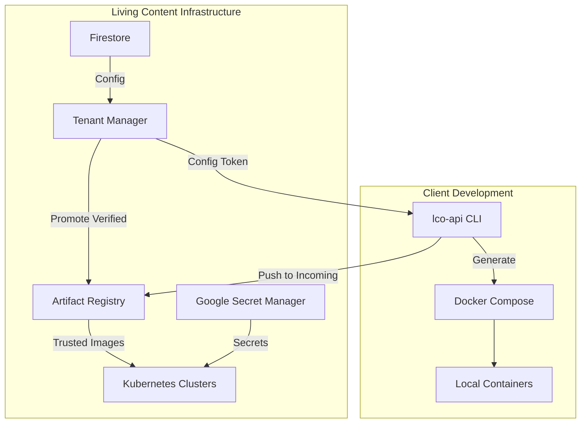

# Living Content API Client Architecture

## 1. Overview

Living Content provides a **secure, token-based workflow** for clients to configure local development environments, build container images, and deploy to managed infrastructure.

**Core principles:**

- **No direct pushes to production registries** by developers.
- **All images must be signed, verified, and promoted** before running in Kubernetes.
- **Secrets are centrally managed** in Google Secret Manager (GSM).

---

## 2. Architecture



---

## 3. Configuration Management

### 3.1 Layers

**Client YAML Configs** (maintained by client):

- `clients.yaml` – AI provider settings
- `eqty.yaml` – Bias/equity settings
- `internal_functions.yaml` – Custom functions
- `persona.yaml` – AI personality
- `plugins.yaml` – Plugin configurations

**Infrastructure Config** (managed by Living Content):

- Project metadata
- Registry URLs
- Cluster assignments

**Secrets** (in GSM):

- API keys
- Database passwords
- TLS certificates

---

## 4. Container Registry Security Model

### 4.1 Two-Registry Workflow

```plaintext
project-images-incoming/     # Developer push target (quarantine)
└── stage-project-{id}-{component}

project-images/              # Trusted registry (read-only to humans)
└── stage-project-{id}-{component}@sha256:...
```

- **Incoming Registry** → Writable by developers for image pushes.  
- **Trusted Registry** → Writable only by the Tenant Manager service account; read-only to Kubernetes clusters.

---

### 4.2 Developer Build & Promotion Flow

```bash
# 1. Build and push to incoming registry
IMAGE_INCOMING="us-central1-docker.pkg.dev/living-content/project-images-incoming/stage-project-${PROJECT_ID}-${COMPONENT}:$(date +%s)"
docker build -t "$IMAGE_INCOMING" .
docker push "$IMAGE_INCOMING"

# 2. Resolve digest from registry
DIGEST=$(gcloud artifacts docker images describe "$IMAGE_INCOMING"   --format="value(image_summary.digest)")

# 3. Sign image with GCP KMS key
cosign sign --key gcpkms://projects/living-content/locations/global/keyRings/living-content/cryptoKeys/image-signer   "${IMAGE_INCOMING}@${DIGEST}"

# 4. Request promotion
curl -X POST https://tenant-manager.stage/api/images/verify-and-promote   -H "Authorization: Bearer $TOKEN"   -d "{\"image\":\"$IMAGE_INCOMING\",\"digest\":\"$DIGEST\"}"
```

---

### 4.3 Tenant Manager: Verify & Promote Steps

1. Verify **Cosign signature** against GCP KMS key.  
2. Check **vulnerability scan** results from Artifact Registry (fail on HIGH/CRITICAL).  
3. Apply **policy checks**:
   - Size limits
   - No `latest` tags
   - Non-root user
4. Promote **exact digest** to `project-images` (trusted registry).  
5. Generate **Cosign attestation** for compliance.  
6. Record promotion event in allowlist (digest, metadata, signer, scan results).

---

## 5. Admission Control

Kubernetes enforces that **only promoted, signed images** can run:

```yaml
apiVersion: kyverno.io/v1
kind: ClusterPolicy
metadata:
  name: trusted-images-only
spec:
  validationFailureAction: Enforce
  background: false
  rules:
    - name: enforce-trusted-repo-and-digest
      match:
        any:
        - resources:
            kinds: [Pod]
            namespaces: ["project-*"]
      validate:
        message: "Images must come from trusted registry and use digest pinning."
        pattern:
          spec:
            containers:
              - image: "us-central1-docker.pkg.dev/living-content/project-images/*@sha256:*"

    - name: verify-gcp-kms-signature
      match:
        any:
        - resources:
            kinds: [Pod]
            namespaces: ["project-*"]
      verifyImages:
        - imageReferences:
            - "us-central1-docker.pkg.dev/living-content/project-images/*"
          key: "gcpkms://projects/living-content/locations/global/keyRings/living-content/cryptoKeys/image-signer"
```

---

## 6. Local Development

### 6.1 CLI Commands

```bash
lco-api init                 # Initialize with config token
lco-api config fetch         # Fetch latest config
lco-api docker generate      # Create docker-compose.yaml
lco-api docker up            # Start containers
```

### 6.2 Directory Structure

```plaintext
project/
├── .lco-api.json           # Local config cache
├── .env                    # Environment variables
├── docker-compose.yaml     # Generated by CLI
├── config/                 # Client YAML configs
└── app/                    # Application code
```

---

## 7. Security Controls

- **Registry IAM**:  
  - `project-images-incoming`: Devs can write, TM can read.  
  - `project-images`: Only TM SA can write; clusters can read.
- **Signatures**:  
  All images signed with GCP KMS key (`image-signer`).
- **Verification**:  
  Vulnerability scanning + policy checks before promotion.
- **Admission Control**:  
  Kyverno enforces trusted repo, digest pinning, and valid signature.
- **Secrets**:  
  Stored in Google Secret Manager, never in `.env` for production.

---

## 8. Implementation Status

**Done:**

- Config token generation
- Tenant Manager API basics
- Basic project creation

**In Progress:**

- Two-registry setup
- KMS key creation
- Tenant Manager verify-and-promote
- Kyverno policy deployment

**Planned:**

- CLI completion
- Config versioning
- Secret Manager CSI driver integration
