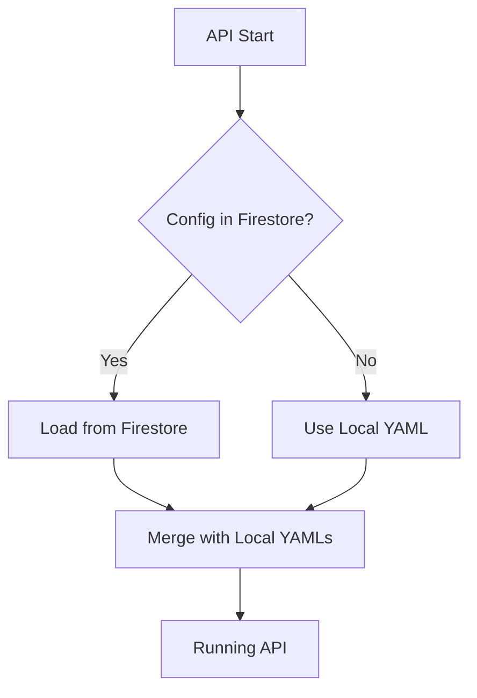

# LCO-API Documentation

## Overview

`lco-api` is a modern CLI tool for managing Living Content API deployments. It replaces the complex bash/Python orchestrator setup with a streamlined, type-safe implementation using:

- **Pydantic** for data validation and serialization
- **Clicycle** for beautiful CLI output
- **Firestore** for configuration storage
- **Token-based authentication** with Tenant Manager

## Architecture

### Design Principles

1. **Separation of Concerns**: Business logic is isolated in services for future MCP (Model Context Protocol) support
2. **Type Safety**: Strong typing throughout with Pydantic models
3. **Cloud-Native**: Configuration stored in Firestore, secrets in Google Secret Manager
4. **Token-Based**: Uses JWT tokens for secure configuration retrieval
5. **Minimal Local State**: Only essential config stored locally

### Key Components

```
lco-api/
├── src/
│   ├── cli/          # CLI commands (thin layer)
│   ├── services/     # Business logic (reusable)
│   ├── models/       # Pydantic data models
│   └── utils/        # Shared utilities
├── documentation/    # User and developer docs
└── tests/           # Test suite
```

## Configuration Flow

### Initial Setup

1. **Receive Token**: Get one-time configuration token from DevOps
2. **Fetch Config**: Use token to retrieve project configuration from Tenant Manager
3. **Store in Firestore**: Save configuration to Firestore for runtime access
4. **Keep Local Essentials**: Store minimal config locally (`.lco-api.json`)

### Runtime Configuration



### Configuration Storage

| Configuration Type | Storage Location | Description |
|-------------------|------------------|-------------|
| Project Config | Firestore | Container images, resources, environment |
| Local YAMLs | `config/*.yaml` | Client configs, plugins, persona, internal functions |
| Secrets | Google Secret Manager | API keys, credentials |
| SSL Certificates | Local `.ssl/` | Internal TLS certificates for containers |

## Commands

### Initialize Project

```bash
# First-time setup with token
lco-api init --token YOUR_TOKEN --tenant-manager-url https://tm.stage.example.com

# This will:
# 1. Fetch configuration
# 2. Store in Firestore
# 3. Generate SSL certificates
# 4. Create docker-compose.yaml
```

### Configuration Management

```bash
# View current configuration
lco-api config show

# Update configuration in Firestore
lco-api config update --key api.replicas --value 3

# Sync from Firestore
lco-api config sync

# Generate permanent API token
lco-api config token
```

### Docker Management

```bash
# Generate docker-compose.yaml
lco-api docker generate

# Start containers
lco-api docker up

# Stop containers
lco-api docker down

# View logs
lco-api docker logs
```

### SSL Certificate Management

```bash
# Generate internal SSL certificates
lco-api ssl generate

# Verify certificates
lco-api ssl verify

# Renew certificates
lco-api ssl renew
```

## Security

### TLS/SSL for Internal Communication

All inter-container communication uses TLS:

- **MongoDB**: TLS mode required with client certificates
- **Redis**: TLS enabled with certificate verification
- **API**: Connects to databases using TLS

### Token Security

- **One-Time Tokens**: Configuration tokens can only be used once
- **Permanent Tokens**: Long-lived JWT tokens for API operations
- **Token Storage**: Stored securely in local config, never in version control

## Migration from Old System

### What's Different

| Old System | New System |
|------------|------------|
| `lc.sh` bash script | `lco-api` Python CLI |
| `orchestrator.py` | Service classes with business logic |
| Multiple YAML configs | Firestore + essential local YAMLs |
| Complex SSL setup | Simplified internal-only certificates |
| Manual config management | Token-based with Firestore storage |

### Migration Steps

1. **Get Configuration Token**:
   ```bash
   lco-devops project config-token create --project-id YOUR_PROJECT_ID
   ```

2. **Initialize with lco-api**:
   ```bash
   lco-api init --token YOUR_TOKEN --tenant-manager-url https://tm.stage.uscentral1-tenant-1.livingcontent.co
   ```

3. **Copy Local YAMLs**:
   ```bash
   cp .templates/config/{clients,eqty,internal_functions,persona,plugins}.yaml config/
   ```

4. **Start Services**:
   ```bash
   lco-api docker up
   ```

## Development

### Setup Development Environment

```bash
# Clone repository
git clone <repo>
cd living-content-api/lco-api

# Install with uv
uv sync

# Activate virtual environment
source .venv/bin/activate

# Run CLI
lco-api --help
```

### Running Tests

```bash
# Run all tests
uv run pytest

# Run with coverage
uv run pytest --cov=src

# Run specific test
uv run pytest tests/test_config_service.py
```

### Code Quality

```bash
# Format code
uv run ruff format .

# Lint code
uv run ruff check .

# Type checking
uv run mypy src
```

## Troubleshooting

### Common Issues

#### "Config not found in Firestore"
- Ensure you've run `lco-api init` with a valid token
- Check Firestore permissions for your service account

#### "SSL certificate verification failed"
- Regenerate certificates: `lco-api ssl generate`
- Ensure certificates are mounted in Docker containers

#### "Token already used"
- Request a new token from DevOps
- Tokens are one-time use for security

### Debug Mode

Enable debug output for troubleshooting:

```bash
lco-api --debug [command]
```

## API Integration

The API reads configuration at startup from:

1. **Firestore** (primary source)
2. **Local YAMLs** (for client-specific configs)
3. **Environment variables** (for overrides)

### Example API Configuration Loading

```python
from google.cloud import firestore

class ConfigLoader:
    def load(self):
        # Load from Firestore
        db = firestore.Client()
        config = db.collection("project_configs").document(PROJECT_ID).get()
        
        # Merge with local YAMLs
        for yaml_file in ["clients", "eqty", "internal_functions"]:
            with open(f"config/{yaml_file}.yaml") as f:
                config[yaml_file] = yaml.safe_load(f)
        
        return config
```

## Future Enhancements

- **MCP Support**: Model Context Protocol server for AI assistants
- **Config Versioning**: Track configuration changes over time
- **Multi-Environment**: Support for dev/stage/prod configurations
- **Backup/Restore**: Configuration backup to GCS
- **Audit Logging**: Track all configuration changes